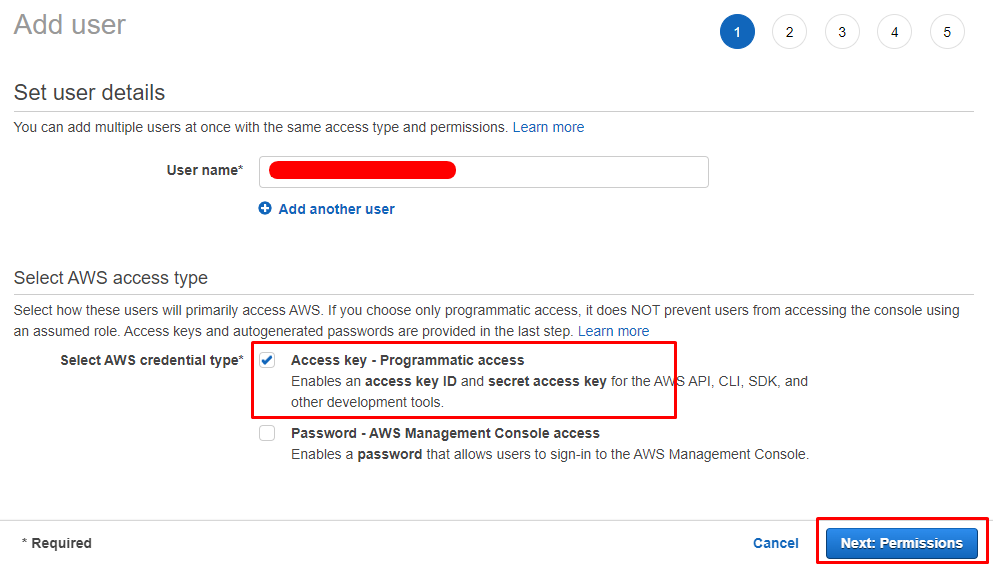
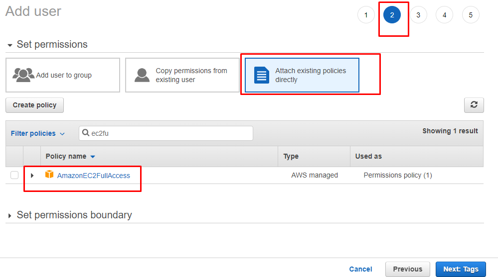
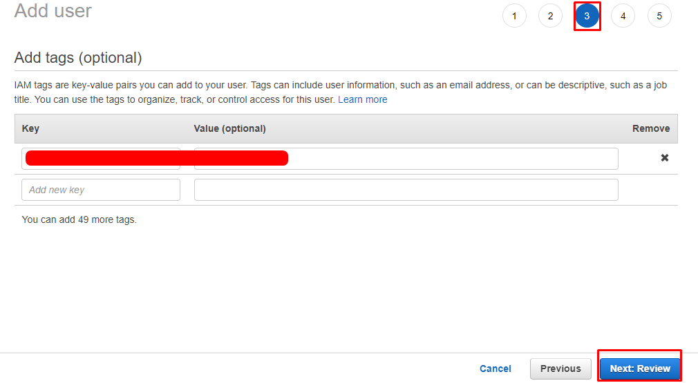
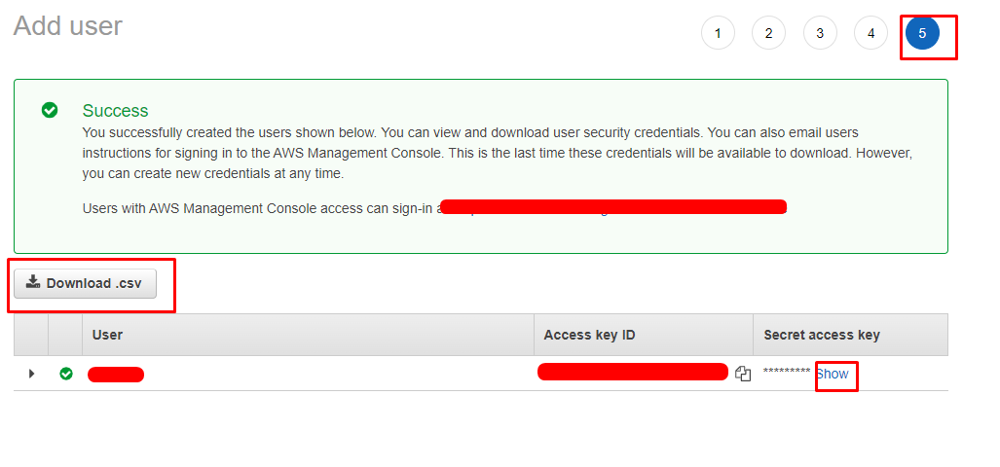
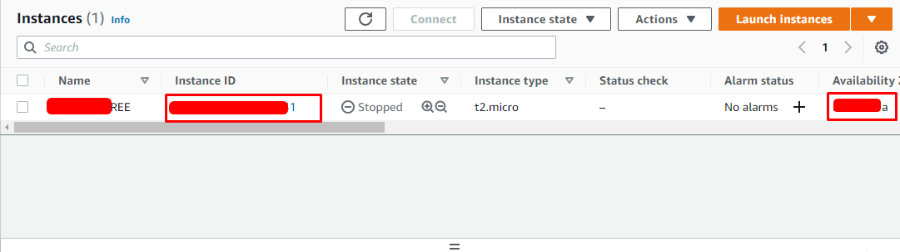
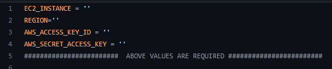
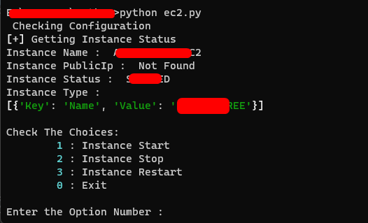
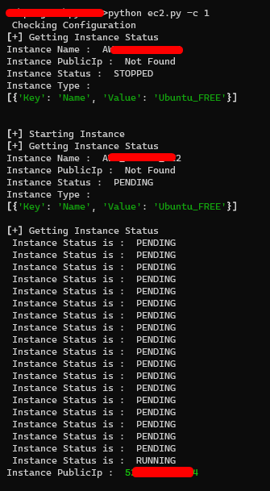

# ec2_bot

This ec2 program helps to manage the single EC2 instance

## Requirement

* Python3

### Library

* boto3==1.24.54
* rich==12.5.1

### Install Library

> Install the library before running the program

`pip install boto3==1.24.54 rich==12.5.1`

## Configuration

> Create IAM User with Programatic access

> Give Full EC2 Access Policy

> Add tag an click next then create user

> Download The access key and copy the access and secret Key

> Got to Your Instance Copy the Instance Id and Availability Zone

> Give Those Copied information To  `ec2.py` program

## Usage

> After installing the library you can run the program in intractive mode by `python ec2.py`

> If you like to run the program by argument follow the below commands

* `python ec2.py -c 0` To Get status of the instance
* `python ec2.py -c 1` To Start the instance
* `python ec2.py -c 2` To Stop the instance
* `python ec2.py -c 3` To Restart the instance

